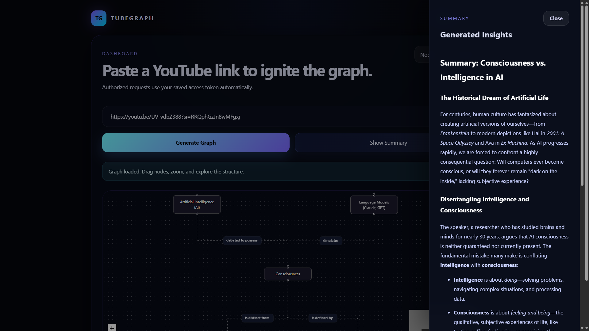
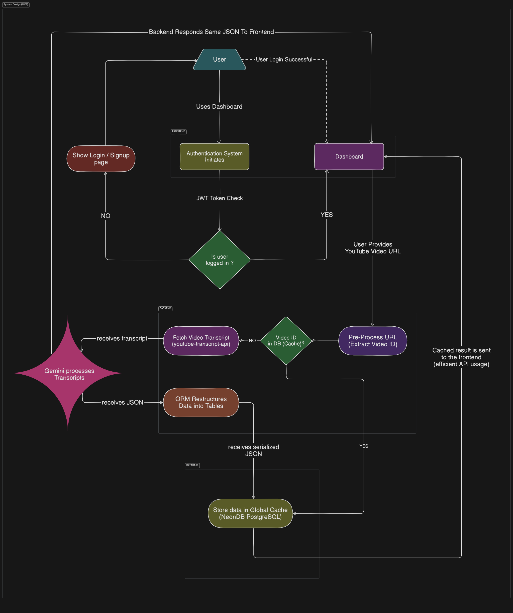
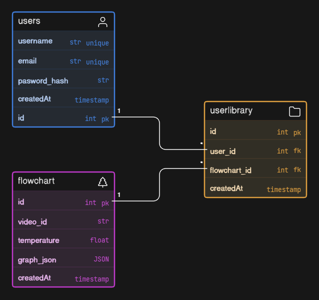

<h1 align="center">🛰️ TubeGraph: AI-Powered Video Knowledge Mapper</h1>

  
  
  
  
  

<h3 align="center">"Turning linear watch-time into non-linear knowledge maps."</h3>

## 🎥 Demo

 

## 🌊 The Vision (The "Ocean")

Most people treat YouTube as a "passive" learning tool, watching videos from start to finish. **TubeGraph** flips this. It treats a video as a **Knowledge Base**.

By extracting transcripts and processing them through LLMs, TubeGraph identifies **Atomic Concepts** and their **Prerequisites**. The result is an interactive graph where a 20-minute video is condensed into a semantic map and summary you can navigate in 20 seconds.

 

## 🛠️ The Architecture (The "Industry Standard" Stack)

| Layer | Responsibility | Technology |
| --- | --- | --- |
| **Orchestration** | Containerization & Portability | **Docker** (`docker-compose`) |
| **Client** | Interactive Graph UI & State | **React.js + React Flow** |
| **API** | Async Processing & Logic | **FastAPI (Python)** |
| **Intelligence** | Semantic Extraction & JSON Structuring | **Gemini 1.5 Flash** |
| **Ingestion** | Metadata & Transcript Scraping | **YouTube Transcript API** |
| **Database** | Global Graph Caching & User Auth | **PostgreSQL (NeonDB)** |
| **ORM & Migrations** | Pythonic Database Interactions | **SQLAlchemy + Alembic** |
| **Styling** | Clean, Dark-themed "Dev" Aesthetic | **Tailwind CSS** |

 

## ⌛ Quick Start
TubeGraph is fully containerized. You do not need to install Python or Node locally.
1. Clone the repo: `git clone https://github.com/your-username/tubegraph.git`
2. Create your `.env` file from the example: `cp .env.example .env`
3. Spin up the cluster: `docker-compose up -d --build`
4. Open your browser to `http://localhost:5173`

 

## 🌳 System Design & Entity Relationship Diagram

 

 

## 📈 Future Updates

- **"Forgot Password" Flow:** Implementing secure, time-limited email reset tokens.
- **User-Scoped Caching:** Segregating global read-only caches from user-specific graph edits.
- **Telemetry & Logging:** Integrating advanced API rate-limit monitoring and error logging.
- **Multimodal Processing:** Upgrading from transcript-parsing to raw video/audio processing via Gemini.

 

<h2 align="center">Made with ❤️ by <a target="_blank" href="https://twitter.com/TheCodedHuman">TheCodedHuman</a></h2>